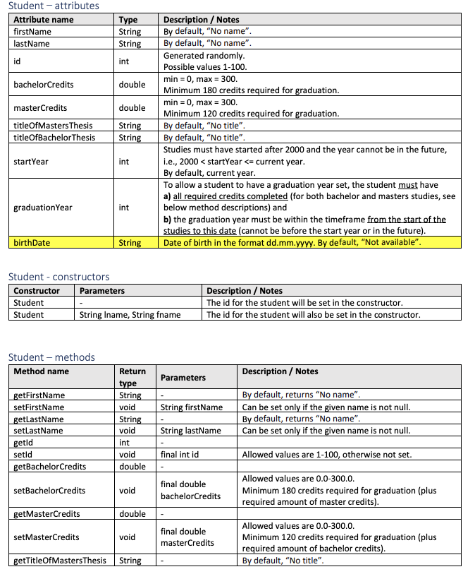
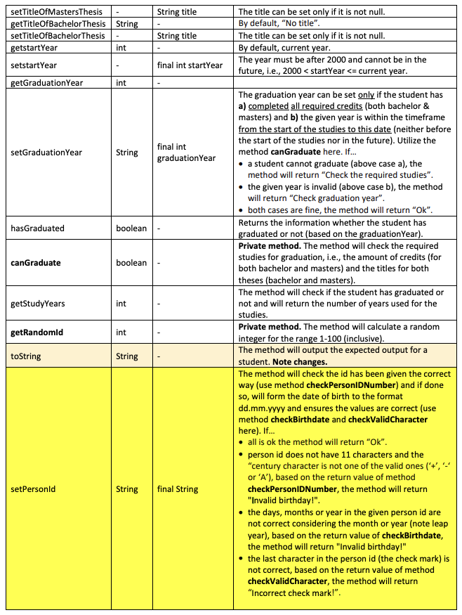
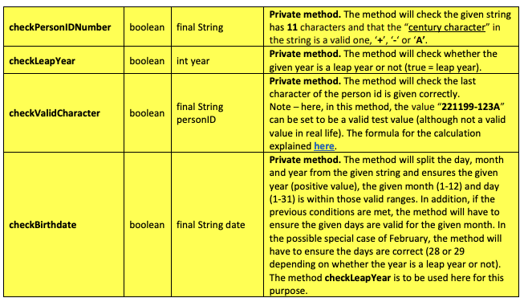

# This is University of Oulu programming course 2 homework.
Programmed by Don Hämäläinen (2023), The task has been planned by Päivi Raulamo-Jurvanen (University of Oulu)

This homework is created using Java programming languages. The homework assignment was to create student (Class) that includes getter and setters. There were two versions of the homework. Version 2 and version 1, of which version 2 was more challenging. This is version 2.

