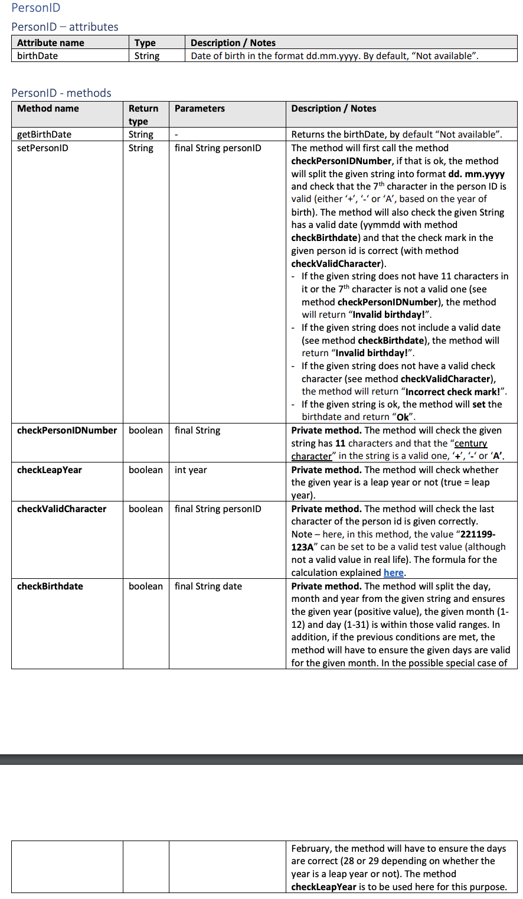
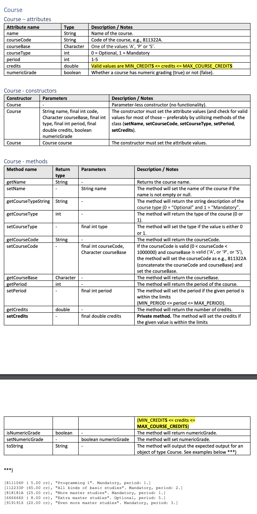
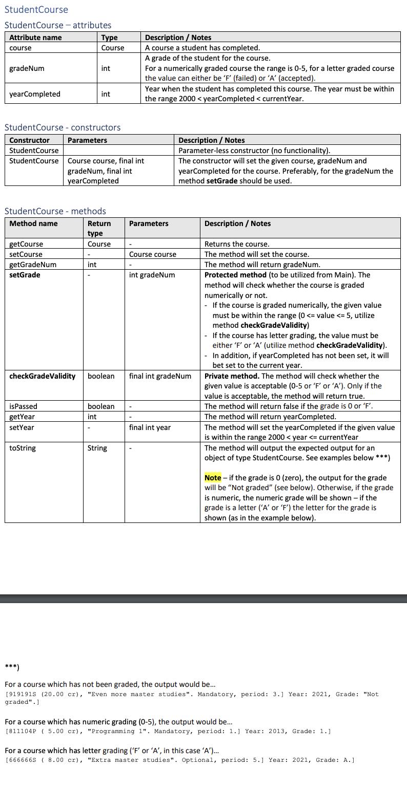
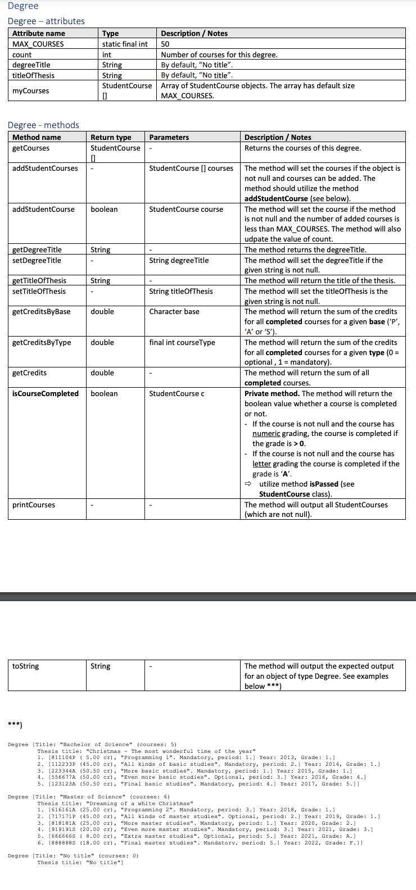
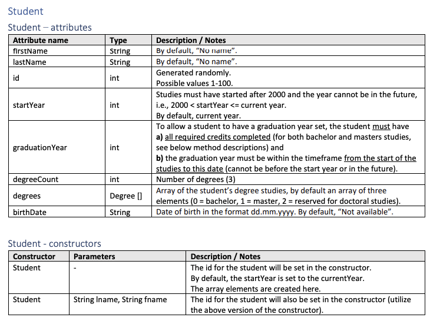
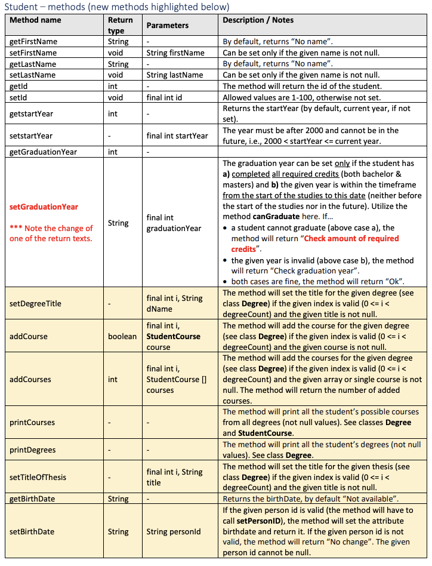
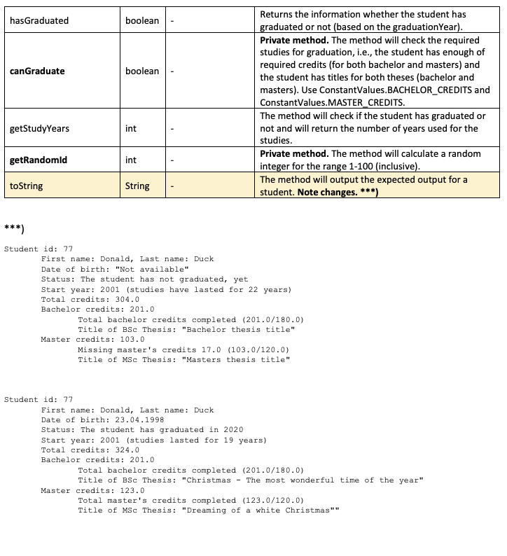

# This is University of Oulu programming course 2 homework.
Programmed by Don Hämäläinen (2023), The task has been planned by Päivi Raulamo-Jurvanen (University of Oulu)

This is second homework out of four homeworks (2/4). You can find my first homework in "Kotitehtävä1" folder. 
This is version 2 HW2 and used Java programming language.

# PersonID class

# Course class

# StudentCourse class

# Degree class

# Student class!

